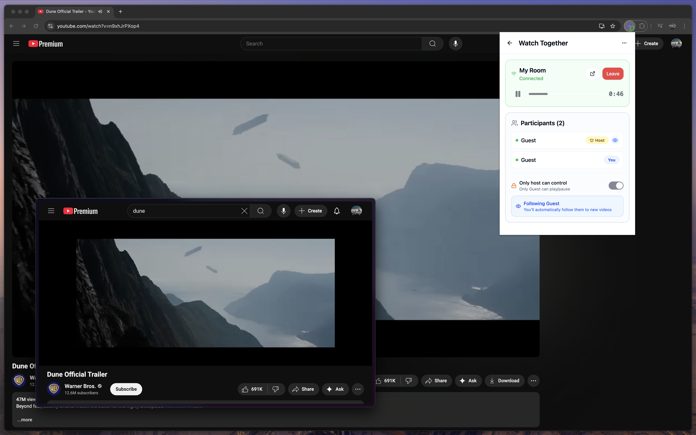

# Watch Together

Sync video across the web with friends. Watch on any site, stay in perfect sync.

## Development

Run `pnpm install` to get started.

`pnpm dev` — Start development  
`pnpm build` — Build everything  
`pnpm test` — Run tests  
`pnpm lint` — Lint code  
`pnpm typecheck` — Check types

`pnpm extension:dev` — Work on browser extension  
`pnpm backend:deploy` — Deploy backend

The codebase is a pnpm monorepo powered by [Turborepo](https://turborepo.com/), with apps in `apps/` and shared code in `packages/`.
